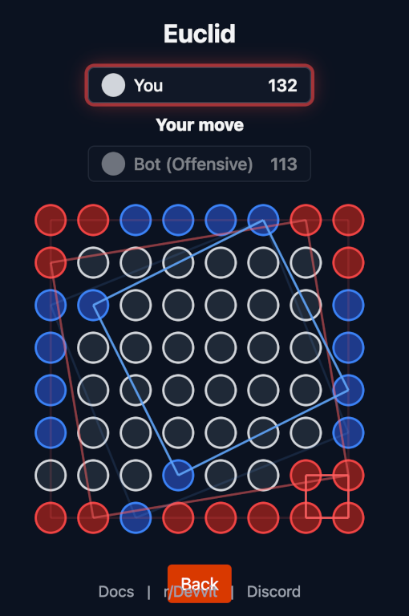

# Euclid

Euclid is a turn-based Reddit strategy game about claiming grid points and completing squares. Play a fixed competitive match against Euclid, configure an unranked Practice game, challenge another Redditor, or watch a live human match.

[Open the configured test community](https://www.reddit.com/r/ripred_euclid_dev/)



The local package is `0.1.109` and the project is pinned to Devvit `0.14.2`. Deployment and Git pushes are separate operations.

The intended public-facing community is [r/EuclidTheGame](https://www.reddit.com/r/EuclidTheGame/), currently private for beta testing. The current original build is installed there as `0.1.109`, confirmed by a separate installation readback on September 7, 2026. The development subreddit was not changed and was last verified at `0.1.99`. The communities' matching icon and desktop/mobile banners were unchanged; the development playtest target remains `r/ripred_euclid_dev`. Installation verification is separate from the desktop and native-mobile gameplay checks below.

## Game rules

Players alternate placing one dot on an empty grid position. A placement scores every new square whose four corners are dots owned by that player. Squares may be axis-aligned or rotated, and one move may complete several squares.

The game supports two scoring systems:

- **Grid Footprint** counts the inclusive grid positions along the larger axis of the square's smallest axis-aligned enclosure, then squares that count. For corners with coordinate bounds `minX`, `maxX`, `minY`, and `maxY`, points are `max(maxX - minX + 1, maxY - minY + 1)²`. Corner order and mirrored or quarter-turned orientation do not change the result.
- **True Area** scores the square's geometric area. On the integer grid this is the squared distance between adjacent corners, found as the smallest non-zero pairwise squared corner distance.

The first player to reach the target wins. If the board fills first, the higher score wins; equal scores produce a tie. Practice target recommendations scale from the 8×8, first-to-150 baseline, stay above the smallest scoring event, and never exceed the board's theoretical total.

## Game modes

| Mode                 | Rules                                                                                   | Rating          | Persistence and assistance                                                                     |
| -------------------- | --------------------------------------------------------------------------------------- | --------------- | ---------------------------------------------------------------------------------------------- |
| Ranked vs Euclid     | 8×8, Grid Footprint, first to 150, human first, Brutal                                  | Ranked solo Elo | One active game per user; reload resumes it; assistance is disabled                            |
| Practice vs Euclid   | Even dimensions from 4 through 16, either scoring mode, supported target and difficulty | Unrated         | Server-authoritative custom game; hints and local auto-move tools are allowed                  |
| Redditor vs Redditor | 8×8, Grid Footprint, first to 150                                                       | Multiplayer Elo | Matchmaking, reload resume, leave/forfeit, rematch, participant chat, and read-only spectating |

Canceling Ranked before the first human move is unrated. Abandoning after play begins records one loss. Ending Practice never changes Ranked Elo.

Ranked solo Elo starts at 1200 and uses K=32 against Euclid's fixed 1600 reference rating.

Euclid has nine difficulty levels. Brutal prioritizes its own immediate win, then prevents an opponent's immediate win, compares immediate offensive and defensive value, and finally pursues longer-term square construction.

The home screen shows the selected difficulty beside **Play Euclid** and offers **Change difficulty**. Practice remembers a valid selection in browser storage, falling back to Beginner when storage is unavailable. Ranked and resumed games retain their server-owned rules.

## Authority and integrity

The browser is a presentation and intent layer, not a source of official results. Opening developer tools or changing client JavaScript cannot submit an official score, winner, AI move, or final board.

- H2H clients submit a game ID, coordinate, and expected revision. The server verifies the participant, turn, revision, cell, score, completed squares, outcome, and persisted board.
- Solo clients submit start rules or a coordinate intent with an expected revision and command ID. The server owns the session, private RNG seed, AI selection, complete move history, result, metrics, and Ranked settlement.
- New solo command receipts retain exact retry responses for 24 hours. While a receipt exists, reusing its command ID for different intent is rejected. Each user can allocate up to 4,096 receipts or 32 MiB of serialized receipts per 24-hour budget window; retries of existing receipts do not consume this allocation budget. Canonical revision and terminal checks still apply after receipt expiration.
- Solo starts, state reads, moves, and abandonment share a 120-request-per-minute allowance per user, checked before replay validation, including receipt retries. Request and allocation limits return HTTP 429 with retry guidance.
- Practice games and unshared results expire 48 hours after a new command receipt, outliving every associated 24-hour receipt. Reads and receipt replays do not renew retention. Ranked history, ratings, and prepared or published shares remain durable. Untouched older Practice records and receipts retain their existing lifetime until rewritten; there is no deletion sweep.
- H2H pairing and rematches atomically charge both players against an allowance of 100 new rounds per 24-hour window. Resuming costs nothing, and exhausted queue entries do not block eligible players. These per-account limits bound allocation rates, not total historical storage or traffic from multiple accounts.
- A started H2H game's ten-minute turn timeout records a forfeit against the player whose turn expired. Only an accepted move starts a fresh turn clock; chat and spectator activity cannot extend it. Expiration is settled on subsequent game access or cleanup, preserving the terminal board and exactly-once rating settlement. Unplayed expired pairings cancel without affecting ratings.
- Leaderboard and H2H sharing reserve their existing per-user, per-kind cooldown atomically before submitting a post, so simultaneous requests cannot bypass it.
- Redis compare-and-set transactions serialize competing mutations. H2H terminal results are archived immutably by game ID and terminal revision in the same transaction that ends the round; they enter a durable outbox and settle rating and metrics exactly once.
- Solo result shares are prepared from canonical completed human victories and finalized through an idempotent receipt. New submissions and explicit failure retries reserve a ten-second per-user cooldown across games; prepared and posted duplicates do not resubmit. Unconfirmed in-flight receipts remain pending to avoid duplicate posts. Client-claimed result uploads are rejected.
- Practice data never enters the versioned Ranked-solo namespace. Unverifiable legacy HVA ratings remain untouched but are excluded from current rankings.

Pure rules are shared between client and server to keep behavior DRY. Server validation and persistence remain the trust boundary.

Home records, resume and queue status, and live scoring effects are projections of server-owned state. Score feedback comes only from an accepted canonical move or a newly observed canonical move. Loading or resuming establishes a quiet baseline and does not replay or invent prior scoring events.

## Application surfaces

- The default inline post entrypoint fits the post container without document or nested scrolling: intro, the existing rules-demo artwork, then compact live standings. Tap **vs Redditors** or **vs Euclid** to choose a standings bucket. Preview onboarding is complete only after the full demo finishes.
- **Start Playing!** and **Watch Live** stay visible throughout the inline rotation. They open the expanded `game` and `watch` entrypoints respectively; Watch goes directly to the spectator lobby without joining a match. **Full leaderboard** opens the expanded `leaderboard` entrypoint, which reuses the full app in rankings mode. Expansion follows the user's button action.
- Solo gameplay shortcuts require a fresh key press during the displayed human turn. Buffered keys, held-key repeats, and partial shortcut input do not carry into the next turn; gameplay keys are ignored while a move is pending or the game has ended. Chat typing is unaffected.
- Expanded solo, multiplayer, and spectator games share a viewport-bounded layout. Board sizing accounts for the actual title, scores, chat, and action controls as they resize or wrap. Unusually small expanded frames retain scrolling rather than clipping controls or shrinking cells below their minimum size.
- The expanded entrypoint opens on a responsive navy-and-vector-grid dashboard. **Play Euclid** is the primary action, **Play a Redditor** is secondary, separate solo and multiplayer ratings are shown, and saved solo games, active Redditor matches, and matchmaking state have explicit continue or cancel controls. Live games, Leaderboard, Options, and Rules remain quieter navigation.
- Canonical scoring moves show `+N` and the completed-square count beside the move and scorecard, animate only the newly completed squares, and briefly show each new square's enclosing footprint in Grid Footprint mode. Players can hide accumulated square lines without hiding the active scoring event; True Area does not show a footprint overlay.
- Live Redditor matches give participants a visible, touch-sized **Chat** control while retaining the `\` keyboard shortcut. The focus-contained composer has explicit Send and Cancel actions, and its chronological live log wraps long messages without trapping the board controls below the viewport. Spectators can read the existing shared log but cannot compose messages.
- After a normally completed Redditor match, either participant can select **Rematch** while both players remain attached. The request is bound to the terminal revision, simultaneous requests converge on one canonical new round, and a player who already left is never silently restored. The server derives ongoing rematch availability from both participant mappings; if either player closes, the remaining client hides the action and stops terminal polling without changing the finished board. If terminal Close and an untouched rematch race, Close cancels that rematch without recording a forfeit. Finished-round sharing is bound to the immutable terminal revision, so a rematch cannot replace the result being shared.
- Shared leaderboard and victory posts have compact inline summaries with an explicit expansion button. Inline leaderboard summaries retain the canonical row order and show only the leading rows that fit; the expanded snapshot retains every row. Inline victories show canonical final scores and outcome; the expanded result includes the full board replay and footer, with a side-by-side layout on wider screens and a keyboard-accessible scroll area on smaller screens. Older solo replay payloads retain their player-one-first fallback.
- A moderator subreddit menu item creates a fresh Euclid post.
- The Watch lobby pairs names and scores using canonical player order and shows board size, score target, and **Last activity**. Its list refreshes every 30 seconds while visible, never overlaps requests, and discards pending responses when the viewer leaves. Loading and retryable errors are distinct from an empty lobby; an empty or unavailable game offers an explicitly recorded **Watch demo** and **Play** path using the existing teaching sequence.
- Spectators receive neutral result copy and a local-only **Stop Watching** action; they cannot mutate or leave on behalf of participants. Completed matches offer **Replay**, **Another live game**, and **Play**. Replay freezes the accepted terminal board and canonical outcome, including forfeits, so later rematches cannot replace it. Missing games do not fabricate a final replay. Result controls receive keyboard focus; the player tutorial does not interrupt watching.

The five sibling edition worktrees - Prism, Lattice, Weave, Tide, and Relay - also separate inline and expanded entries. Their inline previews reuse existing board renderers as passive illustrations with a single **Open** action. They do not start or load a player session, poll spectators, expose point controls, or capture camera gestures. Gameplay, keyboard navigation, spectator controls, and Lattice's camera/layer interactions remain in the expanded game. Edition source is maintained on the separate `redesign/*` branches; these changes have not been installed on Reddit.

## Architecture

```text
src/shared/
  game/engine.ts       Pure board, scoring events, outcomes, and AI policy
  game/rules.ts        Versioned Ranked rules and strict Practice validation
  scoring.ts           Grid Footprint, True Area, totals, and target guidance
  types/api.ts         Contracts shared by the browser and server

src/client/
  preview-main.tsx     Inline-only bootstrap
  preview.tsx          Bounded intro/demo, compact live standings, and share routing
  preview.css          Inline-only post bounds and responsive fitting
  leaderboard.html    Expanded rankings entry, using main.tsx and App
  watch.html          Direct expanded spectator entry, using main.tsx and App
  watch-view.tsx      Shared lobby, replay, unavailable state, and Watch controls
  live-games.ts      Validated, cancellable, visibility-aware live-list requests
  watch-recording.ts Frozen canonical result for the spectator replay
  watch-demo.ts      Existing teaching recording replayed through shared rules
  rankings-loader.ts  Shared validated rankings request
  fetch-json.ts      Shared JSON transport and HTTP-error handling
  share-preview.tsx   Compact inline share summaries and expanded result presentation
  App.tsx              Full-game orchestration, canonical state adoption, and board UI
  home-lifecycle.ts    Queue recovery and stale-request transition policy
  home-screen.tsx      Responsive home dashboard and transition/status surfaces
  home-ui.ts           Pure record, resume, and matchmaking presentation
  h2h-controls.tsx     Accessible participant chat and rematch controls
  score-feedback.ts    Canonical score-event normalization and display geometry
  game-ui.ts           Result, spectator, and responsive-layout decisions
  solo-ui.ts           Solo intents, reconciliation, assistance, and exit policy
  share-replay*.ts(x)  Backward-compatible canonical replay rendering

src/server/
  index.ts             Devvit/Express routes, profiles, rankings, shares, metrics
  h2h.ts               Canonical multiplayer domain rules and validation
  h2h-store.ts         Atomic matchmaking, games, chat, leave, rematch, and terminal-round archives
  h2h-presence.ts      Stable idle, queued, and active multiplayer presence resolution
  h2h-settlement.ts    Durable exactly-once H2H Elo and metric settlement
  solo.ts              Canonical solo domain, replay validation, and redaction
  solo-store.ts        Atomic sessions, idempotency, Ranked Elo, metrics, shares
  request-limits.ts    Shared receipt budgets, retention, and share cooldown reservations
  redis-cas.ts         Shared optimistic Redis transaction seam
```

Redis keys for canonical solo games and ratings are versioned independently from legacy data. Legacy H2H boards are normalized and fully replay-validated when read.

## Local development

Requirements:

- Node.js 24 and npm (Devvit's supported local baseline is currently 24.18.0)
- A Reddit account with Devvit access for playtest, upload, installation, or publication

Install dependencies and run the local quality gate:

```bash
npm ci
npm run type-check
npm run lint
npm test
npm run test:dependencies
npm run build
npm run check:devvit
git diff --check
```

Useful commands:

```bash
npm run dev       # client/server watchers plus Devvit playtest
npm run dev:vite  # browser-only Vite surface on port 7474
npm run build     # production client and server bundles in dist/
```

Tests are colocated as `*.spec.{ts,tsx}` files. `vitest.config.ts` restricts discovery to source files so type-check output in `dist/types` is never run as a second test suite. GitHub CI runs the clean install/build, type check, lint, application tests, dependency regressions, and local Devvit packaging check. The suite covers scoring and AI priorities, canonical replay validation, forged state, stale revisions, command replay/conflicts, concurrent Redis mutations, settlement idempotency, spectator behavior, onboarding, victory effects, responsive layout, home record/resume/matchmaking presentation, H2H presence stabilization, participant-control eligibility and markup, rematch convergence and detachment, terminal-Close/rematch cancellation, immutable terminal-round archives, canonical score-feedback normalization, history-reset handling, footprint geometry, and legacy replay compatibility.

`npm run check` is intentionally mutating: it applies ESLint fixes and Prettier formatting. Use the explicit non-mutating gate above when reviewing a worktree.

Vitest is pinned to `5.0.0`. Devvit stays at `0.14.2`: the deprecated `devvit@1.0.0` package has no CLI executable and breaks playtest/upload. A scoped `@devvit/cli` override selects `inquirer@9.3.8`, which replaces the legacy editor and removes `tmp` from the dependency tree. A version-scoped override replaces the CLI's `js-yaml@4.3.1` with `4.3.2` to enforce empty-map merge limits (GHSA-2883-xcg3-v3hh), preserving the separate patched 3.x dependency used by oclif. Remove this YAML override when a compatible Devvit release supplies the patched dependency. `npm run test:dependencies` checks temporary-file containment, non-string affixes, the editor round trip, input/list/confirm prompts, Vitest mock redirects against Vite file-serving rules, and Devvit YAML merge limits and parsing compatibility. `npm run check:devvit` checks command loading, validates the built entrypoints, and runs the same local bundler used by upload/playtest without uploading or installing. Run it after the build.

The September 11, 2026 full audit still reports three high-severity affected development packages in the Devvit CLI's `image-size` chain; the production-only audit reports zero. These are separate from the resolved `tmp`, Vitest, and `js-yaml` advisories. Do not run `npm audit fix --force`: its proposed `devvit@1.0.0` replacement removes the CLI. Reassess these remaining paths when compatible fixes are available. `@devvit/public-api` is pinned as a development-only packaging compatibility dependency because the 0.14.2 CLI resolves its generated template from the project root; Euclid remains a Devvit Web app and application source must not import that legacy API. `package.json` also pins the reviewed install-script approvals needed by the native build tools—run `npm install-scripts ls` after dependency changes.

## Devvit operation

`devvit.json` defines:

- inline `preview.html` as the default tall post entrypoint;
- `index.html` as the expanded `game` entrypoint;
- `leaderboard.html` as the expanded `leaderboard` entrypoint;
- the server bundle at `dist/server/index.cjs`;
- the moderator **Create Euclid Game Post** menu action;
- `r/ripred_euclid_dev` as the playtest subreddit.

External-state commands should be run deliberately:

```bash
npx devvit login
npx devvit playtest
npm run deploy                         # build and upload a private version
npx devvit install <subreddit> ripred-euclid@<version>
npx devvit list installs <subreddit>
npx devvit view ripred-euclid@<version>
```

`npm run launch` uploads and requests publication; it is not part of the normal verification gate. A successful local build does not prove that a version was uploaded or installed.

## Assets

- Preserve the established page artwork and icons, including the landing page, splash screen, and demo. Change them only when explicitly requested; functional UI work does not authorize artwork changes.
- `Euclid-Game2.png` is the repository overview image.
- `src/client/public/snoo.png` is the bundled splash background referenced by server-created posts.
- `subreddit/images/` contains curated branding candidates and moderator upload assets. These are not runtime imports; keep purpose-named files needed for final selection or a distinct Reddit upload role.

## Real-surface verification

Before installing a release beyond the test subreddit:

1. Verify dashboard idle, saved-solo, queued, and active-H2H states; resume an in-progress Ranked game after reload and verify cancel-versus-forfeit behavior.
2. Complete Ranked win, loss, and tie paths; confirm one rating settlement and winner-only sharing.
3. Complete custom Practice games across sizes, scoring modes, targets, and difficulty; verify live score feedback and the accumulated-line toggle, and confirm Ranked data is unchanged. Hold or rapidly press gameplay shortcut keys during a pending move: the next human turn must require a fresh press, and no gameplay key may place a dot after the result.
4. Queue two accounts, reload both, verify local-response and polled-opponent score feedback, and test simultaneous/stale moves, pointer/touch and keyboard chat entry, leave/forfeit, and rematch.
5. Open **Watch Live** from each inline phase. Exercise loading, retry, an empty lobby, and the recorded demo. Spectate both winner sides, a forfeit, and a tie; confirm neutral copy, no celebration, read-only input, and local-only exit. Check result focus and Tab wrapping, **Replay / Another live game / Play**, frozen replay after participant rematches, and unavailable-game fallback. Leaving during a pending request must not reopen the old route.
6. Exercise preview onboarding, explicit tutorial dismissal, same-breakpoint resizing, height-only resizing, orientation changes, and increased zoom. In Reddit desktop card/compact views and the native mobile app, verify that inline intro, demo, standings, loading/error states, and edition previews fit without document or nested scrolling, leave the parent feed's wheel/touch scrolling available, and keep their action visible. Check pointer and keyboard activation of **Start Playing!**, **Full leaderboard**, and each edition's **Open** action; no preview should expand or start an edition session on its own. After expansion, verify full rankings access, normal gameplay scrolling and controls, and Lattice camera/layer gestures.
7. Verify leaderboard shares render their canonical frozen snapshot and result shares retain their exact terminal-revision replay, including when a rematch has already begun. Inline summaries must fit without scrolling and keep their expansion action visible at desktop/mobile widths and increased zoom. After expansion, every snapshot row and the entire replay and footer must remain reachable, including by scrolling and keyboard navigation where needed.

The full real-surface checklist still requires three distinct Reddit identities, simultaneous player sessions, a fresh browser-storage context, and a physical Reddit mobile-app session. Ranked win, loss, and tie outcomes also cannot be selected deterministically from the release surface; use naturally completed games unless an isolated, non-production QA fixture is designed and approved.

## Optional enhancements

- **Interactive first-score onboarding:** Add a guided lesson on the real board that asks the player to place a dot, reveals a one-move scoring opportunity, lets the player complete it, and then introduces rotated and larger squares.
- **Accessibility and mobile completion:** Make board spots semantic keyboard-operable controls with coordinate and occupancy labels, arrow navigation, and Enter or Space placement. Add non-color ownership cues and accessible dialog focus behavior; complete dynamic-viewport, safe-area, and practical large-board touch-target support; verify Assist-mode touch behavior; and suppress the remaining celebration and assistance animations when reduced motion is requested.
- **Balance and configuration:** Define Short, Standard, and Marathon targets from desired turn counts and playtesting, measure first-player performance, alternate the opening player in rematches, and simplify the nine AI choices into clearer player-facing tiers while retaining their personality labels where useful.
- **Chat and spectator privacy:** Decide whether chat merits retention. If retained, disclose that spectators can read it and add appropriate mute, report, and moderation controls before wider public play. Remove or reframe AI echo chat unless it gains an intentional gameplay purpose.
- **Independent rules verification:** Add an independent reference oracle, golden fixtures, and generated-board or property comparisons that do not reuse the production decision path, supplementing the existing replay-validation and tampering coverage.

## Pending release work

- Run the real-surface checklist above against installed `0.1.109` on Reddit desktop card view, compact view, and the native mobile app. The current release passed type-check, lint, all 451 tests across 32 files, and client/server builds. Automated fixtures do not establish native-platform behavior; the installation readback is not a gameplay check.
- Keep the five unshipped edition branches separate from this installed original release.
- After private-beta results are acceptable, decide whether the community remains private, becomes restricted, or opens publicly, and prepare any introductory or how-to-play post.

## License

MIT. Copyright (c) 2025-2026 Trent M. Wyatt. See [LICENSE](LICENSE).
