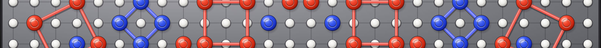

# Euclid

**A minute to learn. A lifetime to master.**

Euclid is a turn-based strategy game you play right inside Reddit. Place a dot, claim the four corners of a square, and score. That's the basic idea. The fun starts when you notice that squares don't have to sit upright, corners can do double duty, and one well-placed dot can finish several squares at once.



Play against Euclid, challenge another Redditor, or watch a match and see what you would have done differently. Practice lets you try different boards and difficulty levels without putting your rating on the line.

[Visit r/EuclidTheGame](https://www.reddit.com/r/EuclidTheGame/) · [Run it locally](#try-it-locally) · [Try the challenge playground](#a-few-pieces-a-few-squares)

The Reddit community is the beta home. This README describes the code in this checkout, which can be ahead of the version installed there.

## How to play

1. Take turns placing one piece on an empty point.
2. Own all four corners of a square to score it. Straight, diamond-shaped, or leaning at an odd angle: they all count.
3. Reach the target score before your opponent. If the board fills first, the higher score wins; equal scores are a draw.

Pieces inside a square or along its edges don't get in the way. The corners are what matter. That also gives you a way to defend: claim the open corner your opponent needs before they get there.



_A position from the built-in teaching game, drawn with the same board renderer used during play._

Ranked games use **Grid Footprint** scoring. Imagine an upright box around your square, count the grid points along one side, then square that number. A footprint three points wide scores 9; one four points wide scores 16. Tilted squares use the same rule. Practice also offers **True Area**, which scores the square's actual geometric area.

The splash screen walks through a complete teaching sequence, then rotates through standings and game choices. **Play now** takes you straight to those choices. You can pause the rotation, use its arrows, or swipe between panels. Transitions fade through the current light or dark background, and the play, watch, and leaderboard controls stay in place.

## Pick a game

| Mode                     | What you'll play                                                                                                                  | Rating          |
| ------------------------ | --------------------------------------------------------------------------------------------------------------------------------- | --------------- |
| **Ranked vs Euclid**     | An 8×8 board, Grid Footprint scoring, first to 150. You move first; Euclid plays at **Tenderfoot**.                               | Solo Elo        |
| **Practice vs Euclid**   | Choose an even board width and height from 4 through 16, scoring, target, and one of nine difficulty levels. Hints are available. | Unrated         |
| **Redditor vs Redditor** | An 8×8 board, Grid Footprint scoring, first to 150. Includes matchmaking, chat, rematches, and live spectators.                   | Multiplayer Elo |

**Change difficulty** appears in Practice. Ranked keeps the same preset for everyone. Reloading resumes a saved solo game; canceling Ranked before your first move is unrated, while leaving after play begins records a loss.

You can place pieces with a mouse or keyboard (arrow keys to move, Enter or Space to place). On touch screens with small board points, the first tap aims and the second tap on that point places. Completed squares light up so you can see exactly where the points came from.

The two leaderboards keep solo and multiplayer results separate. **Watch live** opens the Redditor match lobby; if nobody is playing, you can watch the recorded teaching game instead.

## A few pieces, a few squares

The challenge playground starts with some pieces already on the standard 8×8 board. Your job is to complete a specified number of squares using as few additional pieces as you can. Oblique angles, shared corners, and blocked points make a small puzzle surprisingly tricky.



_A fixed example puzzle. Crossed points are blocked; the solution isn't drawn._

This is currently a **private moderator playground** for testing the puzzle engine. Choose 1–4 target squares and 1–4 minimum moves, adjust the geometry and blocked points, then select **Generate** and give it a go!

The generator checks that the puzzle really needs the requested minimum number of moves. That minimum is something to aim for, not a limit: you can use extra pieces. There's no undo or hint button. You can abandon an attempt or restart the same puzzle and try to beat your best result.

A timer runs from generation or restart until the completing move reaches the server. Your best result uses **fewest moves first, then shortest time**. Switching tabs doesn't stop the clock. Attempts stay private: they don't appear in live games, shared posts, or public rankings.

The editable starting presets are:

| Preset                | Squares | Minimum moves | Geometry |
| --------------------- | ------- | ------------- | -------- |
| Daily starting point  | 3       | 2             | Mixed    |
| Weekly starting point | 4       | 3             | Oblique  |

Daily and weekly scheduling, engagement controls, official entries, and winner settlement are still to come. The splash already has winner panels with avatars, solve times, and previous win counts. Local previews use clearly labeled sample winners; the server returns no winners until official competitions exist, and challenge entry buttons remain disabled.

## Try it locally

Use Node.js 24 and npm. From the repository root:

```bash
npm ci
npm run dev:local
```

Open [the game](http://127.0.0.1:7474/index.html) or [the splash carousel](http://127.0.0.1:7474/preview.html). The local adapter runs the real client and server with in-memory substitutes for the Reddit services, so you can play without a Reddit login. Restarting the server resets local games and results.

To open the playground, use [the local moderator account](http://127.0.0.1:7474/index.html?as=local_moderator), then select **Challenge playground** on the home screen. That moderator identity exists only in the local adapter; Reddit builds check actual subreddit moderator membership on the server.

For a multiplayer test, open `index.html?as=alice` and `index.html?as=bob` in separate tabs. Each tab keeps its own local identity. A third tab can watch through `watch.html`.

The local [full leaderboard](http://127.0.0.1:7474/leaderboard.html) includes **500 fictional players per mode** to exercise a populated list. The splash shows the top three. Sample results can't be shared, and the fixture data isn't included in uploaded builds.

## Working on the game

Euclid uses React and TypeScript on Reddit's Devvit Web platform, with an Express server and Redis-backed game state. Board geometry, square detection, scoring, and input behavior are shared so fixes carry across normal games, replays, and challenges.

The browser sends move intentions. The server checks the turn and position, calculates scores, and settles results. Puzzle solutions and generation seeds stay on the server. For the persistence rules, avatar caching, source map, and release checklist, see the [engineering notes](docs/engineering.md).

Run the checks before committing gameplay changes:

```bash
npm run type-check
npm run lint
npm test
npm run test:dependencies
npm run build
npm run check:devvit
git diff --check
```

`npm run check` applies formatting and lint fixes, so use the individual commands above when you only want to inspect a worktree. Tests live beside the source in `*.spec.ts` and `*.spec.tsx` files.

The package version is **0.2.6** and Devvit is pinned to **0.14.2**. `npm run dev` starts the Reddit playtest workflow for `r/ripred_euclid_dev`; `npm run dev:local` is the standalone workflow above. Building, pushing to GitHub, uploading to Devvit, and installing on a subreddit are separate steps. The [deployment commands](docs/engineering.md#devvit-operation) cover the Reddit side.

### Keeping the pictures current

The README uses the current subreddit banner and two illustrations rendered from the game's own components. The match illustration replays the teaching sequence; the challenge illustration comes from a fixed, certified example. They're documentation illustrations, not screenshots of a live match or competition.

After changing board artwork or the teaching sequence, regenerate them with:

```bash
node tools/render-readme-images.mjs
```

The community icon, desktop/mobile banners, and share background have a separate preview and export page at `/dev/brand-assets.html` while the local server is running. Both sets of artwork use the shared board renderer and design tokens.

## License

MIT. Copyright (c) 2025–2026 Trent M. Wyatt. See [LICENSE](LICENSE).
