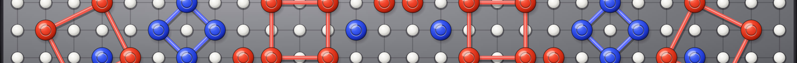

# Euclid

Euclid is a turn-based strategy game you play right inside Reddit. Place a dot, claim the four corners of a square, and score. That's the basic idea. The fun starts when you notice that squares don't have to sit upright, corners can do double duty, and one well-placed dot can finish several squares at once.



Play against Euclid, challenge another Redditor, or watch a match and see what you would have done differently. Practice lets you try different targets and difficulty levels without putting your rating on the line.

[Visit r/EuclidTheGame](https://www.reddit.com/r/EuclidTheGame/) · [Run it locally](#try-it-locally) · [Daily and weekly challenges](#daily-and-weekly-challenges)

The Reddit community is the beta home. This README describes the code in this checkout, which can be ahead of the version installed there.

## How to play

1. Take turns placing one piece on an empty point.
2. Own all four corners of a square to score it. Straight, diamond-shaped, or leaning at an odd angle: they all count.
3. Reach the target score before your opponent. If the board fills first, the higher score wins; equal scores are a draw.

Pieces inside a square or along its edges don't get in the way. The corners are what matter. That also gives you a way to defend: claim the open corner your opponent needs before they get there.



_A position from the built-in teaching game, drawn with the same board renderer used during play._

Every game uses **Grid Footprint** scoring. Imagine an upright box around your square, count the grid points along one side, then square that number. A footprint three points wide scores 9; one four points wide scores 16. Tilted squares use the same rule.

The splash screen walks through a complete teaching sequence, then rotates through the leaderboard and available Daily and Weekly Challenge winners. Its persistent **Open Euclid** button opens the main menu without starting a game. You can pause the rotation, use its arrows, or swipe between panels. Transitions fade through the current light or dark background.

The main menu offers **Play Euclid**, **Play a Redditor**, **Daily Challenge**, and **Weekly Challenge**, followed by **Watch live**, **Leaderboard**, **How to play**, and **Options**. Only enabled challenges appear. Saved-game continuation stays prominent, and matchmaking must be canceled before choosing another activity. **Options** contains Practice/Ranked selection, practice difficulty, square hints, sound, and version information. Difficulty, hints, and sound survive visits. New games are first to 150 points. Moderators also have a **Subreddit** tab for challenge visibility, application timing, live standings, and the Challenge playground.

## Pick a game

| Mode                     | What you'll play                                                              | Rating          |
| ------------------------ | ----------------------------------------------------------------------------- | --------------- |
| **Ranked vs Euclid**     | First to 150. You move first; Euclid plays at **Tenderfoot**.                 | Solo Elo        |
| **Practice vs Euclid**   | Your choice of target and one of nine difficulty levels. Hints are available. | Unrated         |
| **Redditor vs Redditor** | First to 150. Includes matchmaking, chat, rematches, and live spectators.     | Multiplayer Elo |

**Change difficulty** appears in Practice. Its slider has a tick for each of the nine levels and shows the selected level as you move it. Ranked keeps the same preset for everyone. Reloading resumes a saved solo game; canceling Ranked before your first move is unrated, while leaving after play begins records a loss.

You can place pieces with a mouse or keyboard (arrow keys to move, Enter or Space to place). On touch screens with small board points, the first tap aims and the second tap on that point places. Completed squares light up so you can see exactly where the points came from.

After completing a win or loss against Euclid, **Share result** adds an app comment to the pinned **Redditors vs Euclid** hub. Its heading names the winner and includes the score, such as **trent beat Euclid, 156–132** or **Euclid beat trent, 156–132**. Draws and abandoned games cannot be shared.

Redditor match winners share to the pinned **Redditors vs Redditors** hub. Leaderboards are view-only and cannot be shared. Both hubs show the newest app comments first and keep ordinary comments closed. Previously shared standalone posts remain available.

The two leaderboards keep solo and multiplayer results separate. **Watch live** opens the Redditor match lobby; if nobody is playing, you can watch the recorded teaching game instead.

## Daily and weekly challenges

Challenges start with some pieces already on the board. Your job is to complete a specified number of squares using as few additional pieces as you can. Oblique angles, shared corners, and blocked points make a small puzzle surprisingly tricky.



_A fixed example puzzle. Crossed points are blocked; the solution isn't drawn._

When subreddit moderators enable them, **Daily challenge** and **Weekly challenge** appear in the main menu. Everyone plays the same puzzle for that competition. Daily challenges run from **00:00 GMT to the next 00:00 GMT**; weekly challenges run from **Monday 00:00 GMT to the next Monday 00:00 GMT**. The screen keeps the objective, board, timer, and controls within the available height. **Details & standings** shows opening and closing times, standings, and finalized results.

Sign in and select **Start challenge** to reveal the board and start the timer. Complete the target number of squares before the deadline. The certified minimum is something to aim for, not a move limit. There's no undo or hint button. **Retry same puzzle** starts a fresh timed attempt and keeps your best completed result. **Abandon Challenge** discards the active attempt and returns to the game menu, keeping any earlier completed best result. Returning later offers a fresh Start. Using Back, reloading, or switching tabs keeps the attempt running.

Standings use **most squares completed, then fewest moves, then shortest time, then first achieved**. Only your best completed attempt counts. Personal bests, standings, and daily/weekly winner cards show all three result measures. Older results whose square count cannot be recovered show it as unavailable. Challenge results are separate from solo and multiplayer Elo. Moderators can hide live standings; you still see your own result. At the deadline the server finalizes the winner, and enabled challenges can show their latest winner in the splash rotation.

### Moderator controls

**Tide mode** in **Options → Subreddit** applies to all new Practice, Ranked, and Redditor matches. It defaults to off. Games already underway keep their starting mode, and rematches use the current setting. In Tide, an unanchored piece lasts six personal turns; completing a square permanently anchors its corners. Pieces stay fully opaque while their outer rings shrink as turns pass, then briefly fade out when they expire. The first player to 150 points wins, or after 60 total moves the higher score wins; equal scores draw. Standard and Tide have separate ratings and leaderboards, and Tide results and shared replays are labeled. Challenge puzzles keep their own rules.

Only subreddit moderators see **Options → Subreddit**. Its daily and weekly switches default to off; saved changes apply to everyone in that subreddit. Disabling a challenge removes its choices and winner slides and blocks play. It preserves the current puzzle and accepted results, which still settle at their deadline. Re-enabling an unexpired puzzle resumes it, including the elapsed time of an unfinished attempt.

Open **Challenge playground** from that tab to test puzzles privately, even when both competitions are off. The controls support 1–4 target squares and 1–4 minimum moves, geometry, shared corners, multiple solutions, and blocked points. **Load daily settings** and **Load weekly settings** load the saved configuration, including a pending change. **Generate** tests those options privately; **Apply to Daily** or **Apply to Weekly** saves them for the shared competition. A test seed is never saved to a competition.

**Apply changes** defaults to **Next scheduled start**. Applying settings queues them for the next daily or weekly boundary; applying again replaces that pending change. Choose **Immediately** to replace the current puzzle after confirmation. Replacement resets that competition's current entries and standings without awarding the superseded puzzle a winner, and keeps the normal deadline. The existing puzzle stays intact if generation fails. Applying settings never enables a disabled challenge. When enabling a challenge without a current board, the same timing choice determines whether it opens now or at its next scheduled start.

The daily default is three mixed squares in two moves; the weekly default is four oblique squares in three moves. The playground's private attempts do not enter competition standings, live games, shares, or Elo. See the [engineering notes](docs/engineering.md#challenge-competitions) for generation, persistence, and settlement details.

## Try it locally

Use Node.js 24 and npm. From the repository root:

```bash
npm ci
npm run dev:local
```

Open [the game](http://127.0.0.1:7474/index.html) or [the splash carousel](http://127.0.0.1:7474/preview.html). The local adapter runs the real client and server with substitutes for the Reddit services, so you can play without a Reddit login. Settings, games, attempts, standings, and results survive server restarts in the ignored `.local/euclid-state.json` file. Set `EUCLID_LOCAL_STATE` to use a separate state file for an isolated local run.

Open [the moderator preview](http://127.0.0.1:7474/preview.html?as=local_moderator) to use the Subreddit tab and playground locally. That moderator identity exists only in the local adapter; Reddit builds check actual subreddit moderator membership on the server.

For a multiplayer test, open `index.html?as=alice` and `index.html?as=bob` in separate tabs. Each tab keeps its own local identity. A third tab can watch through `watch.html`.

The local [full leaderboard](http://127.0.0.1:7474/leaderboard.html) includes **500 fictional players per mode** to exercise a populated list. The splash shows the top three. Set `EUCLID_SAMPLE_RANKINGS=0` to use actual local game results and test the separate Standard/Tide ladders. Challenge winner samples are off by default; use `EUCLID_SAMPLE_CHALLENGES=1 npm run dev:local` with a separate state file to preview them. Samples are inserted only if no winner record exists, remain subject to the challenge switches, and are labeled as samples. Sample results can't be shared, and fixture data isn't included in uploaded builds.

## Working on the game

Euclid uses React and TypeScript on Reddit's Devvit Web platform, with an Express server and Redis-backed game state. Board geometry, square detection, scoring, and input behavior are shared so fixes carry across normal games, replays, and challenges.

The browser sends move intentions. The server checks the turn and position, calculates scores, and settles results. Puzzle solutions and generation seeds stay on the server. For the persistence rules, avatar caching, source map, and release checklist, see the [engineering notes](docs/engineering.md).

Run the checks before committing gameplay changes:

```bash
npm run type-check
npm run lint
npm test
npm run test:dependencies
npm run test:local-adapter
npm run build
npm run check:devvit
git diff --check
```

`npm run check` applies formatting and lint fixes, so use the individual commands above when you only want to inspect a worktree. Tests live beside the source in `*.spec.ts` and `*.spec.tsx` files.

The package version is **0.2.11** and Devvit is pinned to **0.14.2**. `npm run dev` starts the Reddit playtest workflow for `r/ripred_euclid_dev`; `npm run dev:local` is the standalone workflow above. Building, pushing to GitHub, uploading to Devvit, and installing on a subreddit are separate steps. The [deployment commands](docs/engineering.md#devvit-operation) cover the Reddit side.

### Keeping the pictures current

The README uses the current subreddit banner and two illustrations rendered from the game's own components. The match illustration replays the teaching sequence; the challenge illustration comes from a fixed, certified example. They're documentation illustrations, not screenshots of a live match or competition.

After changing board artwork or the teaching sequence, regenerate them with:

```bash
node tools/render-readme-images.mjs
```

The community icon, desktop/mobile banners, and share background have a separate preview and export page at `/dev/brand-assets.html` while the local server is running. Both sets of artwork use the shared board renderer and design tokens.

## License

MIT. Copyright (c) 2025–2026 Trent M. Wyatt. See [LICENSE](LICENSE).
