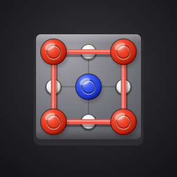
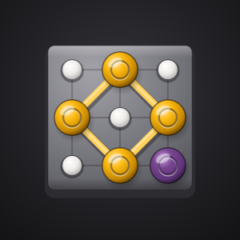
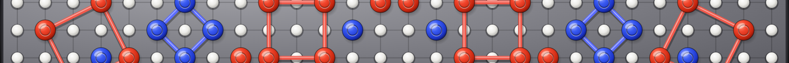

# Amber and amethyst review

This is an opt-in visual proposal. Red and blue remain the default build, and both palettes retain the same player indices, game rules, scores and saved data.

The proposed palette uses warm amber (`#FBB80F`) and deep amethyst (`#5E3478`). Lighter square edges, darker hint rings and separate light/dark text colors keep the pieces and controls readable against the existing graphite board. The community mark uses a complete tilted square with an open center. The banners show a few complete squares instead of repeating a cropped board pattern.

## Compare the artwork

| Current                                                                        | Proposed                                                                                 |
| ------------------------------------------------------------------------------ | ---------------------------------------------------------------------------------------- |
|        |        |
|  |  |
|    |    |

The [proposed entry splash](../src/client/public/splash-amber-amethyst.jpg) keeps the heading and button areas quiet. It is supplied as a separate candidate; existing public artwork files are preserved.

## Preview and export

```bash
VITE_COLOR_SCHEME=amber-amethyst npm run dev:local
```

Open `/dev/brand-assets.html` to compare the current and proposed icon, desktop banner, mobile banner and splash. **Export proposal** writes only the separate amber/amethyst files. The page links to the inline game preview and expanded app.

The supported build values are `red-blue` and `amber-amethyst`. Omission selects `red-blue`; unsupported values fail explicitly. This setting selects both player names and rendering tokens. Reddit's light/dark appearance remains independent.

```bash
VITE_COLOR_SCHEME=red-blue npm run build
VITE_COLOR_SCHEME=amber-amethyst npm run build
```

## Review deployment

After the checks pass, upload the proposed palette explicitly:

```bash
VITE_COLOR_SCHEME=amber-amethyst npm run deploy
npx devvit view ripred-euclid@<uploaded-version>
npx devvit install <review-subreddit> ripred-euclid@<uploaded-version>
npx devvit list installs <review-subreddit>
```

Installing an app version does not change community appearance. The proposed 300×300 icon, 3168×256 desktop banner and 1592×128 mobile banner are separate moderator uploads. Preserve the previous appearance and app version when comparing, and restore them independently if reverting the proposal.

This branch does not publish the app to the directory or merge the proposal. Choosing the theme for a future default release remains a separate decision.
